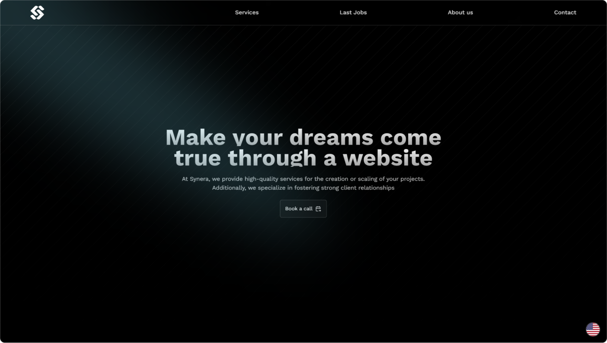
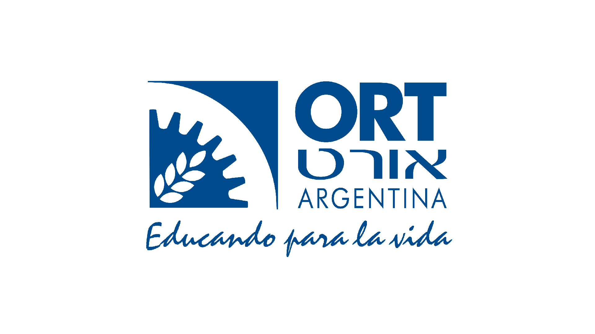
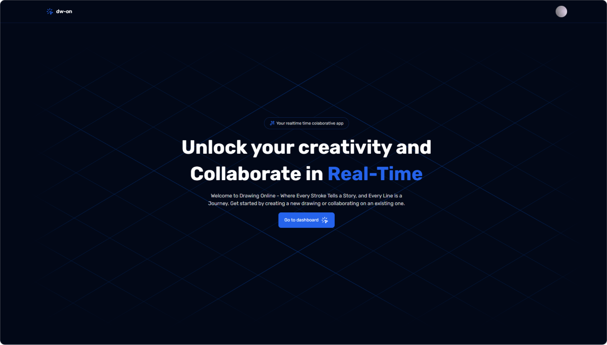
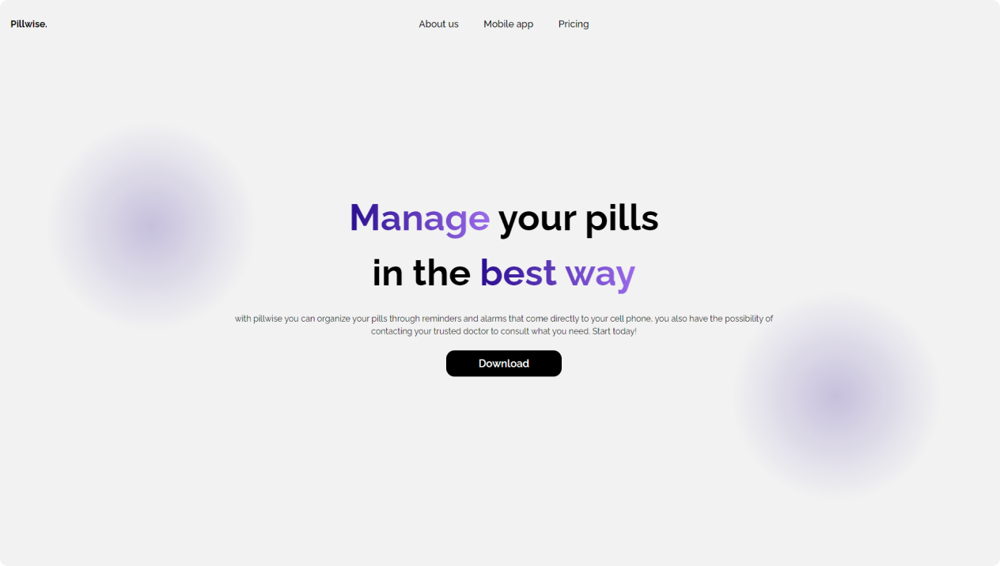

# 👋 Valentin Gonzalez

!Welcome to my portfolio website!

This repository hosts the source code of my personal portfolio website, where I showcase a selection of my projects, skills, and experience in web development and design.

## 📣 Features

- **[Experience and Education](#-experience-and-education):** Discover my professional and educational background, as well as any relevant experience in the field of web development and design.
- **[Featured Projects](#-featured-projects):** Explore a variety of projects I've developed, ranging from web applications to graphic design projects.
- **[Details and Technologies](#-details-and-technologies):** Get detailed information about the technologies i use to develop my web applications.
- **[Contact](#-contact):** Interested in collaborating or just want to say hello? Feel free to contact me through the provided options on my portfolio!

## 📙 Experince and Education

### Synera Digital Agency

#### Co-founder and lead developer at Synera, a digital agency dedicated to providing high-quality services for project creation, innovation, and scalability. Our expertise extends to cultivating robust client partnerships.

---

### ORT Argentina

#### Graduated with honors from ORT Argentina, specializing in Information Technology and Communication.
Degree: Bachelor of Technology and Communication.

## 🥇 Featured Projects

### Drawing Online

Drawing Online is a real-time collaborative application where users can create diagrams, shapes, and drawings directly in the browser. Similar to Excalidraw or Paint, this intuitive and accessible tool fosters creativity and collaboration in visual projects effortlessly.

---

### Pillwise App

My first progressive web application for mobile called Pillwise, it aims to serve as a reminder for people to take their medications and keep track of them.

## ⚒ Technologies i use

- HTML
- TailwindCSS / Css
- JavaScript / TypeScript
- Next.js / Astro.build / Vite.js
- Python / Rust
- Git / GitHub
- Supabase / PlanetScale / Mysql
- Postgres / Sql
- Prisma / Drizzle ORM

## 📱 Get in touch

- Argentina, Buenos Aires
- valentinta@icloud.com
- +5491144489123
- https://valentin-portfolio.vercel.app

## ⚖ License

This repository is MIT Licesed.

## Explore, Get Inspired, and Connect!

Thank you for visiting my portfolio website! Feel free to explore my projects and don't hesitate to reach out if you have any questions or suggestions.
